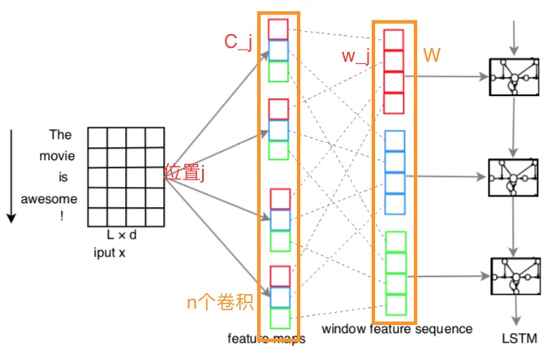
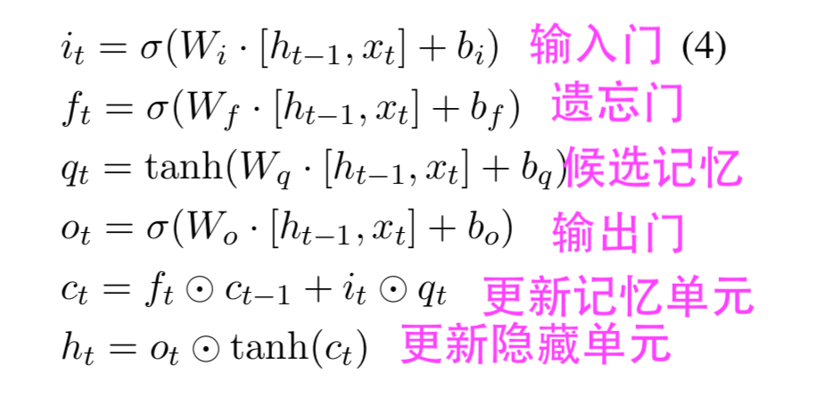

# C-LSTM
CLSTM 模型是结合了CNN模型对局部特征的捕获能力的优点和LSTM模型对长序列特征的捕获能力的优点对文本进行分类的。

下图介绍了C-LSTM模型的基本结构。先用CNN模型先提取文本的局部特征，然后对这些局部特征按照一定方法进行重组形成的特征向量，再将这些新的特征向量输入到LSTM模型中。



下面是LSTM模型的函数：主要是三个门和一个记忆单元。


## C-LSTM模型应用与文本分类

### CNN模型
`!$x^i ∈ R^d $`表示文本中第i个词的d维向量。`!$x ∈ R^{L×d}$`表示长度为L的文本的向量矩阵。`!$m ∈ R^{k×d}$`表示CNN卷积层的filter大小。
`!$w_j = [x_j,x_{j+1},··· ,x_{j+k−1}]$`表示在句子每个j位置，有k个连续词向量组成的窗口向量`!$w_j$`,这些词向量是行向量的并联。

对于窗口向量为k(即k-grams),其特征映射为`!$c ∈ R^{L−k+1}$`。特征映射中的每个元素`!$c_j$`由`!$w_j$`通过下面式子产生的。
```mathjax!
$$
c_j =f(w_j ◦m+b)
$$
```
◦表示点乘，f表示sigmoid函数或者tanh函数等激活函数，而本文选择ReLU激活函数。

n个卷积核filters对每个窗口`!$w_j$`产生的特征映射为`!$W = [c_1;c_2;··· ;c_n]$`。W是有列向量并联的。`!$c_i$`是由第i个卷积核filter产生的。
`!$W ∈ R^{(L-k+1) × n}$`每一行`!$W_j$`是由n个filters的窗口向量`!$w_j$`在位置j生成的新的特征表示。

本文中CNN模型只使用的一层卷积层。而且一般CNN会使用Pool操作，Pool操作是提取全局特征，是一种非持续的行为，它会破坏文本的特征序列性，这就会破坏后面的LSTM操作，
因为LSTM模型是对序列数据进行操作的。

### LSTM模型

将LSTM模型最后一个时刻的隐藏状态作为文本的表示，然后添加softmax层，利用cross-entropy误差函数标出文本属于哪个类。

```mathjax!
$$
y^{(i)} ∈ {1,2,··· ,k} 
$$
```
K表示类别标签的数量。而且其值的为[0,1]。
对目标函数采用**随机梯度下降**算法学习模型参数，优化方法是RMSprop。

对于文本的处理，主要是对大文本进行截取长度截取，大于规定长度maxlen的，截掉后面的文本；对于小于maxlen的文本，用特殊字符\<PAD>补充。
初始化词向量时，利用均匀分布[-0.25, 0.25]进行初始化。

在训练模型的时候，将对CNN的卷积层和softmax层前的LSTM模型进行dropout操作。并对权重进行L2正则化。


