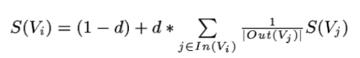
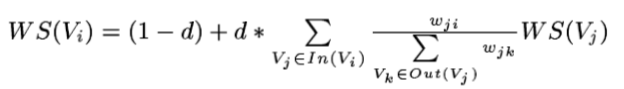

# TextRank

TextRank 算法是一种基于图的用来处理文本的排序模型；特别是在关键字提取和句子提取方面有显著的优势，并且被作为一种基准存在。

康奈尔大学的Kleinberg提出了HITS算法和谷歌的pagerank算法都是基于图的排序算法，它们都成功的应用到社会网络和Web中的链接分析。

## PageRank

基于图的排序算法是基于全局信息来计算每个节点的重要性。其基本思想是对每个节点进行投票或者推荐。
每个节点连向其他节点就相当于对其他节点进行了投票。如果某个节点被投票的次数阅读，说明其越重要。并且其投的票的重要性也取决于其本身的重要性。

假设图模型G=(V,E)是包含节点集V和边E集的有向图，E是VxV的子集。给定节点Vi，In(Vi)表示指向该节点的节点集合，Out(Vi)表示节点Vi指向其他节点的集合。
那么节点Vi的分数为(注：这是无加权图模型节点分数的计算方法)：



其中，S(Vi)是节点i的中重要性(PR值)，d表示阻尼系数，其值的范围为(0,1)，一般取0.85。

对于某些节点之间可能有多个或者部分连接，这就显示了这些节点的连接的强度，我们用权重wij表示节点Vi到节点Vj的强度。



权重的初始值为一般是0-10间的随机值。而且加了权重和没加权重的节点的最后分数是有很大差别的。

## 图模型在文本处理中运用

图模型中节点可以对应于文本中单个词，短语或者整个句子等。但是无论添加到图模型节点中的元素是什么，其主要步骤包含：

1、确定最能定义手头任务的文本单元，并将它们作为顶点添加到图形中。\
2、确定连接这些文本单元的关系，并使用这些关系连接图形中的节点。 边可以是定向的或不定向的，加权的或未加权的。\
3、迭代基于图的排名算法，直到收敛。\
4、根据最终得分对节点进行排序。 使用每个节点的值进行排名/选择决策。

## 关键字提取
使用TextRank对文本进行关键字提取的方法，主要是通过构建词汇之间的图模型。如果在一定窗口中，两个词汇共同出现，那么就说明这两个词汇是有联系的。窗口的大小一般为2-10。但是本文最后实验发现，窗口的大小为2最佳。

添加到图模型节点的词汇可以使用句法进行限制，比如只选择哪些具有一定词性的词汇，比如只考虑名词或动词、形容词等。

关键字提取算法的步骤为：\
1、将文本进行符号化，即用数字表示词汇，并且带有词性标记。为了避免图模型过度增长，选择出现次数大于1的词汇，也还可以对词汇对长度进行限制。\
2、在所有词汇进行句法过滤后，连接在同一窗口大小内共现词汇。注意这个图模型还是无权重、无向图模型。每个节点对值初始化为1。然后将这个图使用PageRank算法进行训练，迭代次数为20-30或者前后两次训练所有节点的值的差小于0.0001。\
3、在上面计算的图模型结果的基础上，对图模型的每个节点的分数进行排序。然后选择前T个节点。本文中T的值为图节点数量的1/3。对于毗邻的两个词汇被选入关键字，那么可以组成新的关键字。

## 句子提取
句子提取可以形成文章的摘要。句子提取的放水于关键字提取的方式是类似的。只不过节点换成了单个句子而不是词汇。
在关键字提取方法中以词汇"共现"来决定词汇之间的关系，在这里已经不实用了。在句子提取中，我们使用相似性来度量两个节点(即两个句子)的联系。


其中：分子是两个句子Si和Sj中都出现的词汇，分母是两个句子长度的对数和。当然还是其他方式度量两个句子的相似性的方法。

jieba分词词性标记对照表：

```
a 形容词 (取英语形容词 adjective 的第 1 个字母。)
  ad 副形词 (直接作状语的形容词，形容词代码 a 和副词代码 d 并在一起。)
  ag 形容词性语素 (形容词性语素，形容词代码为 a，语素代码 ｇ 前面置以 a。)
  an 名形词 (具有名词功能的形容词，形容词代码 a 和名词代码 n 并在一起。)
b 区别词 (取汉字「别」的声母。)
c 连词 (取英语连词 conjunction 的第 1 个字母。)
d 副词 (取 adverb 的第 2 个字母，因其第 1 个字母已用于形容词。)
  df 副词*
  dg 副语素 (副词性语素，副词代码为 d，语素代码 ｇ 前面置以 d。)
e 叹词 (取英语叹词 exclamation 的第 1 个字母。)
eng 外语
f 方位词 (取汉字「方」的声母。)
g 语素 (绝大多数语素都能作为合成词的「词根」，取汉字「根」的声母。)
h 前接成分 (取英语 head 的第 1 个字母。)
i 成语 (取英语成语 idiom 的第 1 个字母。)
j 简称略语 (取汉字「简」的声母。)
k 后接成分
l 习用语 (习用语尚未成为成语，有点「临时性」，取「临」的声母。)
m 数词 (取英语 numeral 的第 3 个字母，n，u 已有他用。)
  mg 数语素
  mq 数词*
n 名词 (取英语名词 noun 的第 1 个字母。)
  ng 名语素 (名词性语素，名词代码为 n，语素代码 ｇ 前面置以 n。)
  nr 人名 (名词代码n和「人(ren)」的声母并在一起。)
  nrfg 名词*
  nrt 名词*
  ns 地名 (名词代码 n 和处所词代码 s 并在一起。)
  nt 机构团体 (「团」的声母为 t，名词代码 n 和 t 并在一起。)
  nz 其他专名 (「专」的声母的第 1 个字母为 z，名词代码 n 和 z 并在一起。)
o 拟声词 (取英语拟声词 onomatopoeia 的第 1 个字母。)
p 介词 (取英语介词 prepositional 的第 1 个字母。)
q 量词 (取英语 quantity 的第 1 个字母。)
r 代词 (取英语代词 pronoun的 第 2 个字母，因 p 已用于介词。)
  rg 代词语素
  rr 代词*
  rz 代词*
s 处所词 (取英语 space 的第 1 个字母。)
t 时间词 (取英语 time 的第 1 个字母。)
  tg 时语素 (时间词性语素，时间词代码为 t，在语素的代码 g 前面置以 t。)
u 助词 (取英语助词 auxiliary 的第 2 个字母，因 a 已用于形容词。)
  ud 助词*
  ug 助词*
  uj 助词*
  ul 助词*
  uv 助词*
  uz 助词*
v 动词 (取英语动词 verb 的第一个字母。)
  vd 副动词 (直接作状语的动词，动词和副词的代码并在一起。)
  vg 动语素
  vi 动词*
  vn 名动词 (指具有名词功能的动词，动词和名词的代码并在一起。)
  vq 动词*
w 标点符号
x 非语素字 (非语素字只是一个符号，字母 x 通常用于代表未知数、符号。)
y 语气词 (取汉字「语」的声母。)
z 状态词 (取汉字「状」的声母的前一个字母。)
  zg 状态词*

```

PS：这里的代码的主要结构是https://github.com/letiantian/TextRank4ZH 这里找到。我对其中某些结构进行修改。比如句子的相似性计算方法。


