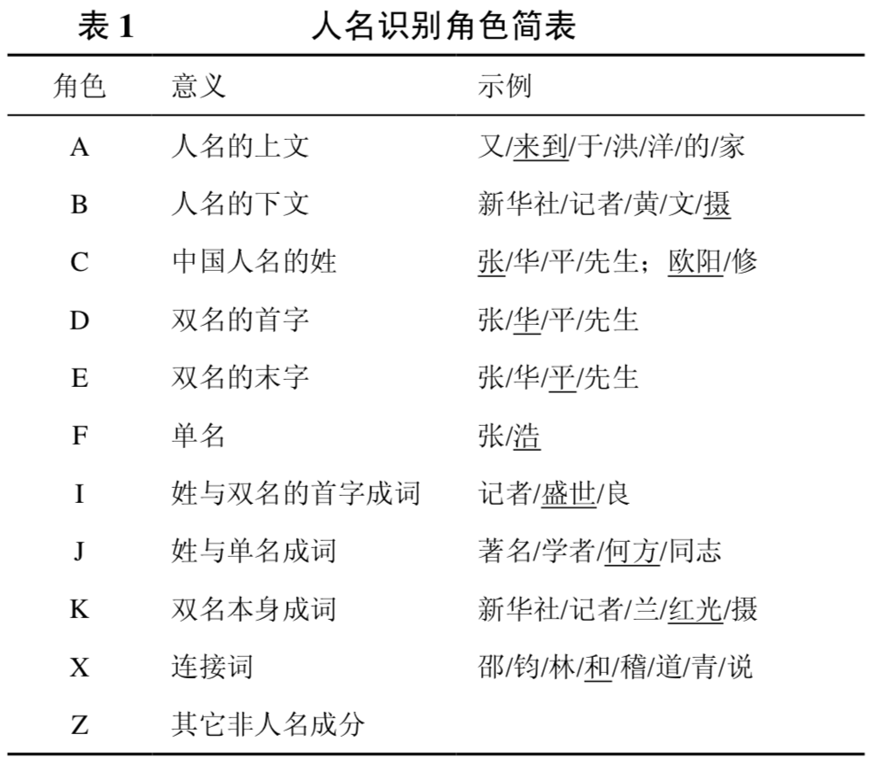
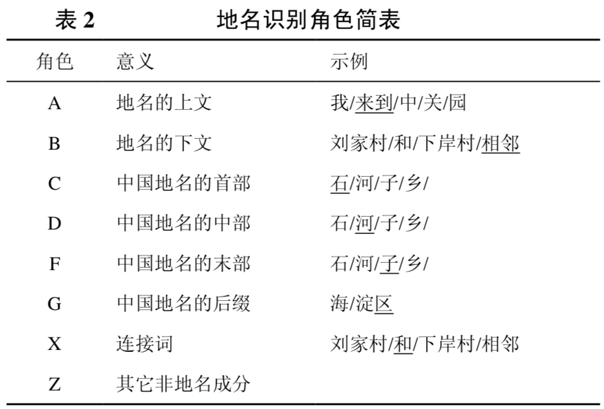
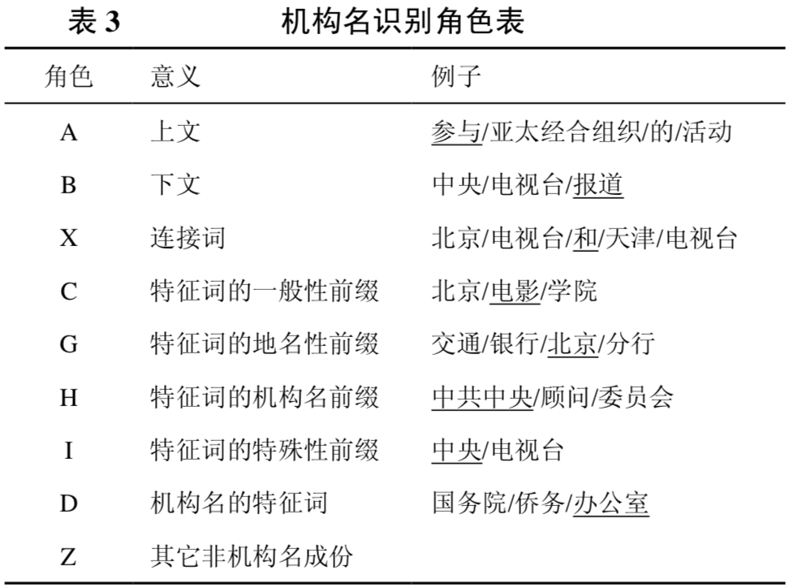
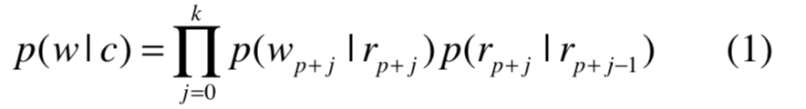

# 基于层叠隐马尔可夫模型的中文命名实体识别

本文提出了一种基于层叠隐马尔可夫模型 (cascaded HMM, cascaded hidden markov model) 的方法，
旨在将人名识别、地名识别以及机构名识别等命名实体识别融合到一个相对统一的理论模 型中。

- 首先在词语粗切分的结果集上，采用底层隐马尔可夫模型识别出普通无嵌套的人名、地名和机构名等。
- 然后依次采取高层隐马尔可夫模型识别出嵌套了人名、地名的复杂地名和机构名。

整个命名实体识别的层叠隐马尔可夫模型由三级互相联系的隐马尔可夫模型构成，自底向上分别为人名识别HMM、地名识别HMM和机构名识别HMM，每一级都是以隐马尔可夫模型作为基本的算法模型。

各层隐马尔可夫 模型之间以如下两种方式互相关联，形成一种紧密 的耦合关系:\
(1) 每一层隐马尔可夫模型都采用 N-Best 策 略，将产生的最好的若干个结果送到词图中供高层 模型使用;\
(2) 低层的隐马尔可夫模型通过词语的生成模 型为高层隐马尔可夫模型的参数估计提供支持。

第一层人名识别的输入为粗切分的分词序列，每一层隐马尔可夫模型都采用改进的Viterbi算法(N-Best),输出最好的若干个结果作为高一级隐马尔可夫模型的输入。最高级隐马模型将在人名识别和地名识别的基础之上进行机构名识别。

采用基于角色标注的隐马尔可夫模型对各类命名实体进行识别。

角色标注的基本思想是:\
根据各类命名实体的构成和用词特点各自制定一套角色标记集，采取Viterbi算法对切分结果进行角色标注(类似于一个简单的词性标注过程)，在角色序列的基础上进行简单的模式识别，最终实现中文命名实体的自动识别。识别过程中， 只需要某个词作为特定角色的概率以及角色之间的 转移概率。

注意：
各类命名实体角色标记集的选取不仅需要根 据其自身特点，结合专家知识科学地设定，而且还 要通过不断地实验，对角色集进行调整。

"其他非**名成分"是否是包含其他与所有命名实体无关的

对于从来没有在词典和语料库中出现过的未登录词的命名体识别，需要引入一个新的模型，即基于角色的词语生成模型。

未登录词w的识别，类别为c，利用隐马尔过程得到：

其中 wi 由第p，p+1,...p+k−1个初始切分单元组成。

这个模型中总共有两个参数: p(w_{p+j} |r_{p+j})和p(r_{p+j}|r_{p+j−1})是两个关键的角色信息参
数。其中p(w_j|r_j)指的是角色为r_j的Token集合中wi的概率。p(r_i|r_{i−1})表示的是角色r_{i−1}到角色r_i 的转移概率。

根据大数定理，可以得到:
p(w_i|r_i)≈C(w_i,r_i)/C(r_i)

其中，C(wi,ri):wi 作为角色ri出现的次数；C(ri):角色ri出现的次数。

p(ri|r_{i−1})≈C(r_{i−1},r_i)/C(r_{i−1})

其中，C(r_{i−1},r_i):角色r_{i−1}下一个角色是r_i的次数。

训练步骤分为3步：\
1. 分词：对语料库的原始文本进行词语的粗切分，得到无任何命名实体识别的切分结果，并统计各分词的出现频率。与语料库中标注好的人名进行比对得到人名的角色语料库。再对角色 语料进行训练，最终得到人名的角色词典和各个角色之间的角色转移概率。
2. 对语料库的原始文本重 新进行切分，利用人名角色词典在粗切分的基础之 上进行人名识别，得到经过人名识别的切分结果。 与语料库中标注好的地名进行比对，得到地名的角 色语料库。地名中经常嵌套有人名，为了识别含有 人名的复合地名，人名识别 HMM 会把识别出来的 人名作为一个人名类输送到地名识别 HMM，人名 类的输出概率可由基于角色的词语生成模型得出， 为了统计人名类的转移概率，我们将角色语料库中 所有的人名转换为\<PER>。
3. 对语料库的原始文本 再切分后得到经过人名和地名识别的切分结果，在与语料库中标注好的机构名进行比对，基于与第三 步同样的理由，我们将所有的人名转换为\<PER>， 机构名转换为\<LOC>，得到机构名的角色语料库。
4. 最后得到命名实体识别所需的三个角色词典和角色转移概率。

