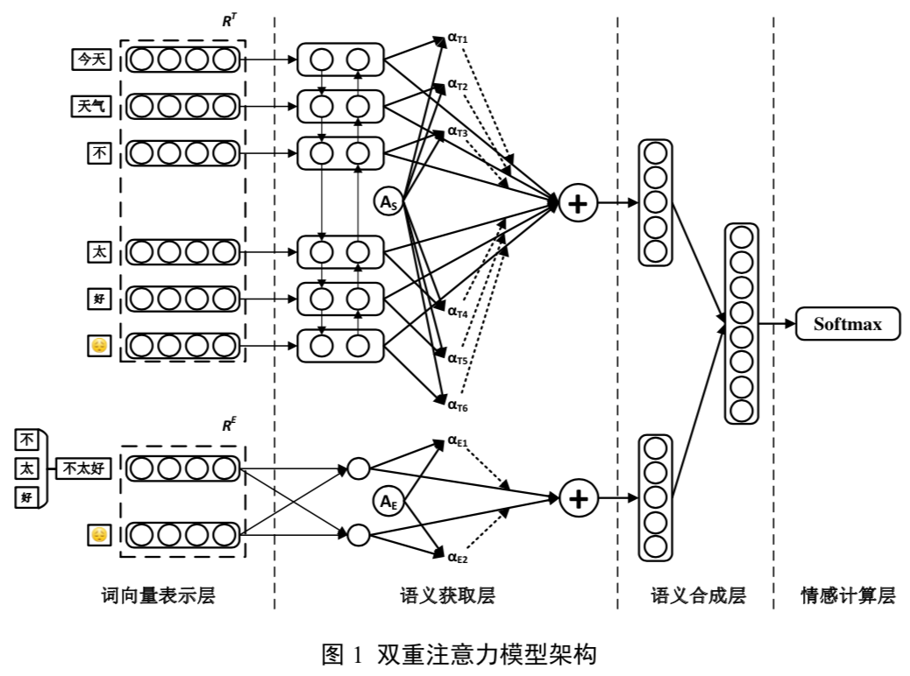

# 情感分析

## 数据集

知网情感分析用词语集[本地地址](NLP/datasets/sentiment/hownet),点击下载[地址](http://www.keenage.com/html/c_bulletin_2007.htm)。

台湾大学简体中文情感极性词典[本地地址](NLP/datasets/sentiment/ntusd)。

程度副词[本地地址](NLP/datasets/sentiment/advdegree)

情感词汇本体的数据集[本地地址](NLP/Dataset/sentiment/情感词汇本体/情感词汇本体.xlsx)

大部分词汇是从[github](https://github.com/data-science-lab/sentimentCN/tree/master/dict)上下载的。

# 基于双重注意力模型的微博情感分析方法

该方法首先利用现有的情感知识库构建了一个包含**情感词**、**程度副词**、**否定词**、**微博表情符号**
和**常用网络用语的微博情感符号库**;然后，采用**双向长短记忆网络模型和全连接网络**，
分别对**微博文本和文本中包含的情感符号**进行编码;接着，采用**注意力模型**分别构建微博**文本和情感符号**的语义表示，
并将两者的语义表示进行融合，以构建微博文本的最终语义表示;最后，基于所构建的语义表示对情感分类模型进行训练。

## 情感分析简要
情感分析研究主要包括

1）情感识别又称为主客观分类，主要是识别文本中的主观文本，为后续进一步的情感分析奠定基础。

2）情感极性分析：是将情感分为正向和负向两类或者正向、负向和中性三类。

3）细粒度的情感分析：对情感细粒度的类别暂时还没有统一的标准，有 6 类、12 类、18 类甚至 24 类等多种分类方法。
目前在中文情感分析领域应用比较多的是大连理工大学信息检索研究室的7大类21小类的情感分类体系，
7大类情感分别为乐(happiness)、好(like)、 怒(anger)、哀(sadness)、惧(fear)、恶(disgust)、惊(surprise)。

## 情感分析技术
情感分析技术主要分为三种:

1）基于情感知识的方法：主要是构建一些情感词典，通过情感词典对文本中的情感词进行一定的组合计算，实现对文本情感的分析。

2）基于特征分类的方法：主要是采用文本分析技术，提取文本中蕴含的相关语言特征，采用机器学习的方法将情感分析看作分类问题进行处理。
这种方法对于情感特征提取方法的依赖性较大，提取情感特征的好坏将直接影响到最终的分类结果。

3）基于深度学习的方法：主要是采用词向量表示技术，对文本中的词语进行表示，进而构建句子和篇章的语义表示。
在**句子和篇章的语义表示**的基础上，采用深度学习模型对文本中蕴含的情感进行学习，从而实现文本情感的分析

## 情感符号的提取
规则 1:若当前词语为情感词、表情符号和网络用语，直接将当前词语加入到情感符号集合中。

规则 2:若当前词语为程度副词，且当前词语的下一个词语为情感词，则将当前程度副词和情感词作为一个整体加入到情感符号集合中，若情感词存在于情感符号集合中，则将其 删除。

规则 3:若当前词语为否定词，且当前词语的下一个词语为情感词，则将当前否定词和 情感词作为一个整体加入到情感符号集合中，若情感词存在于情感符号集合中，则将其删除; 或者当前词语的下一个词语为程度副词，并且程度副词的下一个词语为情感词，则将当前否 定词和程度副词以及情感词作为一个整体加入到情感符号集合中，若程度副词与情感词的整 体存在于情感符号集合中，则将其删除。

## 双重注意力模型架构

