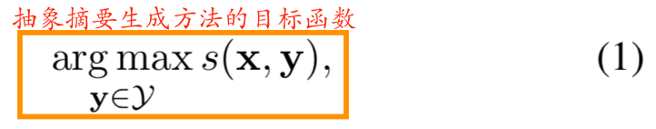
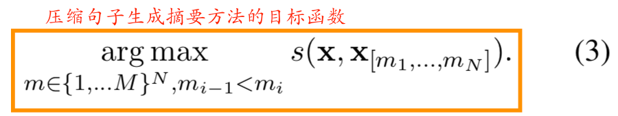
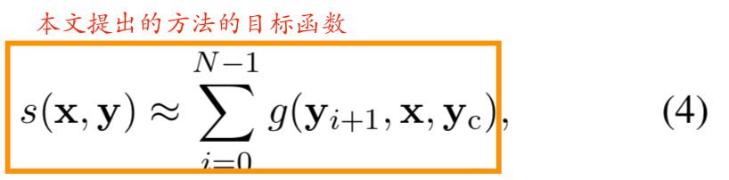
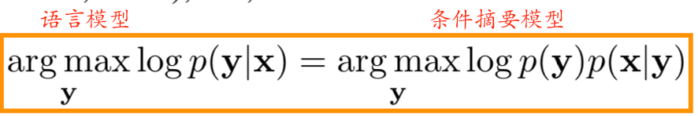
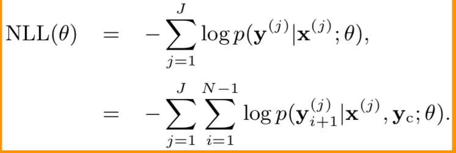
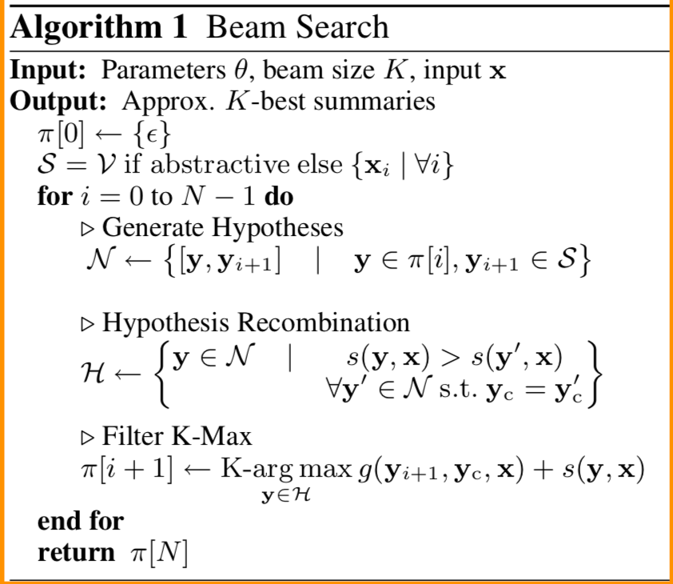
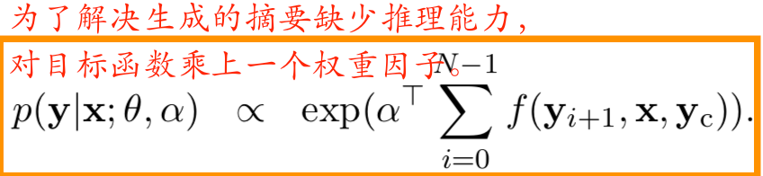
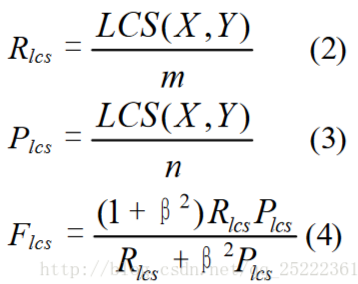

# A Neural Attention Model for Sentence Summarization
这是Facebook提出的用神经网络来生成文本摘要的开山之作，在 github 上有开源的代码放出来，可以参考[facebook/NAMAS](https://github.com/facebookarchive/NAMAS)。

自动摘要技术有两种类型，即抽取式（extraction）和生成式（abstraction）。抽取式摘要 [Neto et al., 2002] 的目标是通过选择源文档中的重要片段并将它们组合来生成摘要；而生成式摘要 [Chopra et al., 2016] 则是根据文档的核心思想来重新组织生成摘要，因此这种摘要的灵活性更高。

本文提出的是一个基于全数据驱动文本摘要生成方法(Attention-Based Summarization (ABS))，该方法基于输入的语句采用局部注意力模型来生成摘要的每个单词。\
大部分成功的文本摘要生成方法，利用萃取法裁剪和粘贴部分文本来生成凝练的文本摘要。与此相反，抽象的文本摘要生成方法意图生成自上而下的文本摘要，即文本摘要不再是原始文本的一部分。

该模型是受到seq2seq模型的启发，encoder端模仿了Bahdanau等人的基于注意力的编码器，因为它在输入文本上学习潜在的软对齐以帮助构造摘要；decoder端是采用光束搜索方式以及在模拟萃取元素时添加了而外的特征。

假设输入的句子序列为：x1,...,xM，即单词长度为`M`。\
词汇表ν的长度为V。\
而且每个词向量用`one-hot`表示，xi ∈ {0,1},i \in {1,2,...,M} 。\
摘要的输出长度固定为`N(N<M)`，即y1,...,yN。而且y属于词汇表ν。

那么如何要生成文本摘要呢？
定义所有可能候选的文本摘要，Y ⊂ ({0,1}^V ,...,{0,1}^V)，其长度都为N。

抽象的文本摘要系统目标函数：

通过提取完整句子来生成文本摘要的目标函数：

通过压缩句子生成文本摘要的目标函数：

而本文的目标函数聚焦于当前单词的先前几个单词：

其中，yc=y\[i-C+1,...,i]，窗口大小为C。

将目标函数转换为对数形式：s(x,y)=log p(y|x;θ)

过去的提取摘要的方法使用噪声通道方法来切分和独立评估语言模型和条件摘要模型。即：

其中:p(y)和p(x|y)是独立估计的。

而本文的神经网络模型包含两部分，一是神经概率语言模型，一是充当条件摘要模型的编码器。

## 模型
### 神经语言模型

参数：θ = (E, U, V, W)；E ∈ R^\{D x V}是一个字嵌入矩阵。U ∈ R^\{(CD) x H},V ∈ R^\{V x H},
W ∈ R^\{V x H}是权重矩阵。
D表示词向量的维度，V表示词典大小，C表示移动窗口大小，H表示隐藏层大小。
黑盒子函数enc是对上下文文本进行编码器，其返回形状大小为H的向量。

### 编码器

本文介绍了几种编码器。

<b>Bag-of-Words Encoder</b>

其中:F也是词嵌入矩阵，F ∈ R^\{H x V},p ∈ \[0,1]是对整个输入词的均匀分布。x̃  ∈ R^{H x M}

使用该编码器生成的文本摘要能够捕获词的相对重要性，以区分内容词和停用词或装饰词。

注意：从这里看出，不用处理文本的停用词了。

<b>Convolutional Encoder</b>

卷积编码器由于能够使单词之间能够相互作用，所以它的表现相对于词袋模型更加优异，尽管它不需要上下文信息yc，但是其仍然对输入语句进行编码。

本文使用标准的`延时神经网络(TDNN)`结构轮流使用1维卷积层和max pool层两者。

其中，F是一个词嵌入矩阵，Q ∈ R^\{L x H x 2Q+1}，L是每层神经网络中过滤器的数量。

等式(7)，是时间(1维)卷积层；等式(6)，包含两个元素的1维max pooling层和一个非线性操作；等式(5)是求整个序列的最大值。

每层的x̃ 的尺寸大小是x̄ 的一半。

简单起见，卷积层对边界使用pad操作，而且M>>2^L

<b>Attention-Based Encoder</b>

其中,G ∈ R^\{D x V}是一个上下文的嵌入矩阵。P ∈ R^\{H x (CD)}是一个在上下文词嵌入和输入词嵌入之间映射的新的权重矩阵参数。
Q是滑动窗口。x̄  ∈ R^{H x M}， x̃  ∈ R^{H x M}，p ∈ R^\{M x 1}

## 训练模型

对J个候选摘要对的对数目标函数进行优化：

其中，J表示J个输入的摘要对(x(1), y(1)), . . . , (x(J), y(J))；N表示摘要对长度。

优化方法是采用的是mini-batch stochastic gradient descent。

## 生成摘要
生成摘要的单词需要在词典中去搜索，如果使用Viterbi路径搜索算法来生成摘要的话，其计算复杂度为O(NV^C)。
如果V很大的话，那么搜索起来将会非常困难。

另一种方法是用严格贪婪或确定性的解码器来近似arg max。但是这种会产生非常差的近似。

一个折中方法是使用beam-search解码器，其搜索范围为整个词汇表ν，但是会在摘要的每个位置的单词，限制在K个可能的假设中。

该算法的复杂度为O(KNV)。

由于基于注意力模型能够很好的生成摘要，但是其好像缺少了像人类一样的推理能力，所以对模型进行了修正。

其中:α ∈ R^5 是一个权重向量，f是一个特征函数。

特征函数f被定义为局部条件概率和一些而外的指示函数相结合的函数。

注意，当α=<1,0,...,0>相当于标准的Abs模型。

在训练完模型后，就固定了参数θ和微调α参数。

## 自动文摘评测方法

自动文摘评测方法：Rouge-1、Rouge-2、Rouge-L、Rouge-S。

Rough(Recall-Oriented Understudy for Gisting Evaluation)，是评估自动文摘以及机器翻译的一组指标。它通过将自动生成的摘要或翻译与一组参考摘要（通常是人工生成的）进行比较计算，得出相应的分值，以衡量自动生成的摘要或翻译与参考摘要之间的“相似度”。

分母是参考摘要n-gram的匹配个数，分子是参考摘要和自动摘要共有的n-gram的个数(以参考摘要为基准)。

Rough-L，L即是LCS(longest common subsequence，最长公共子序列)的首字母，因为Rough-L使用了最长公共子序列。
Rough-L计算方式:

其中LCS(X,Y)是X和Y的最长公共子序列的长度，m,n分别表示参考摘要和自动摘要的长度（一般就是所含词的个数），Rlcs,Plcs分别表示召回率和准确率。最后的Flcs即是我们所说的Rough-L。在DUC中，β被设置为一个很大的数，所以Rough_L几乎只考虑了Rlcs，

Rouge-S 即使用了skip-grams，在参考摘要和待评测摘要进行匹配时，不要求gram之间必须是连续的，可以“跳过”几个单词，比如skip-bigram，在产生grams时，允许最多跳过两个词。比如“cat in the hat”的 skip-bigrams 就是 “cat in, cat the, cat hat, in the, in hat, the hat”.

在进行文本处理的时候，文本使用`#`代替所有数字，用`UNK`代替出现次数小于5的单词。

参数设置:\
学习率:0.05，并且如果在每一轮训练中在验证数据集上对数似然分数没有提高，那么将学习率减半。\
mini-batches的大小设置为64;\
D = 200, \
H = 400, \
C = 5, \
L = 3,\
Q = 2

