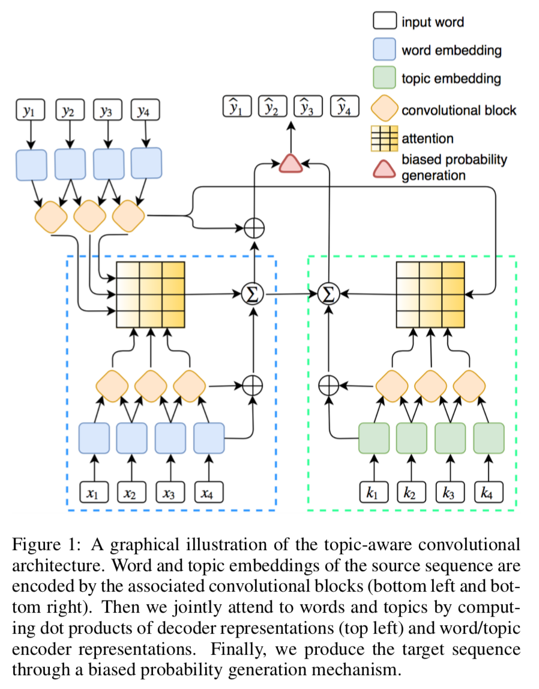
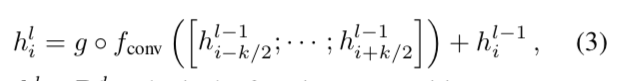
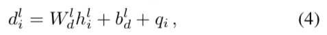
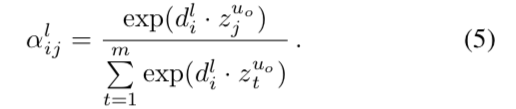
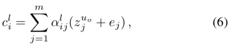

# 一种用于抽象式文本摘要的强化型可感知主题的卷积序列到序列模型
## A Reinforced Topic-Aware Convolutional Sequence-to-Sequence Model for Abstractive Text Summarization

由腾讯知文团队、苏黎世联邦理工学院、哥伦比亚大学和腾讯 AI Lab 的研究者联合提出的。
机器之心首先对其进行简要[介绍](https://www.jiqizhixin.com/articles/IJCAI2018-Tencent-Model-for-Abstractive-Text-Summarization
)。

本文提出了关于生成摘要的新的模型，即ConvS2S (the convolutional sequence-to-sequence model)，该模型是基于将注意力机制和带偏差的概率生成机制相结合，并引入
主题信息的卷积序列到序列的神经网络模型。并用强化学习方法[self-critical sequence training (SCST)](https://arxiv.org/abs/1612.00563)对模型进行优化。
该方法是将贪婪搜索（Greedy Search ）结果作为 REINFORCE 算法中的基线（Baseline），而不需要用另一个网络来估计基线的值。这样的基线设置会迫使采样结果能接近贪婪搜索结果。
这个方法能有效改善生成摘要的连贯性、差异性以及其携带的信息量。用强化学习方法来训练模型，以避免使用不可微的文本摘要指标ROUGE，而是直接优化模型，从而避免了在推断摘要期间的曝光偏差问题(exposure bias)。
- exposure bias：模型训练的时候用的是叫“Teacher-Forcing”的方式：输入RNN的上一时刻的单词是来自训练集的ground-truth单词。而在测试的时候依赖的是自己生成的单词，一旦生成得不好就会导致误差的积累，导致后面的单词也生成得不好。

自动摘要技术有两种类型，即抽取式（extraction）和生成式（abstraction）。抽取式摘要的目标是通过选择源文档中的重要片段并将它们组合来生成摘要；而生成式摘要则是根据文档的核心思想来重新组织生成摘要，因此这种摘要的灵活性更高。

本文的主要贡献有：
- 提出了结合多步注意力机制和带偏置生成机制的方法，将主题信息整合进了自动摘要模型中，引入上下文信息来帮助模型生成更连贯、多样性更强和信息更丰富的摘要。
- 使用了一种强化学习方法（SCST：self-critical sequence training），以针对文本摘要的指标 ROUGE 来直接优化模型，这也有助于缓解曝光偏差问题（exposure bias issue）。

### ConvS2S Architecture

ConvS2S架构包含了卷积神经网络模型(convolutional architecture)、输入词(input words)、主题(topics)、联合多步注意力机制(a joint multi-step attention mechanism)、偏差生成结构(a biased generation structure)、强化学习过程(a reinforcement learning procedure)

ConvS2S模型使用了两种卷积块，一个用于word-level embedding，一个用户topic-level embedding。

<b>embedding</b>

x = (x1, . . . , xm)表示输入的句子。输入元素的embed分布空间为 w = (w1,...,wm)，其中，wi ∈ R^d是随机初始化矩阵Dword ∈ R^{V ×d}中的一行；V是词典长度。
为了保留输入元素的位置信息，增加了位置embed，p = (p1,...,pm)，其中，pi ∈ R^d。最终，输入元素的embed为e = (w1 + p1 , . . . , wm + pm )。
用q = (q1 , . . . , qn )表示在decoder端输出元素的embedding。

<b>卷积层</b>

在encoder端和decoder端构建几层卷积神经网络，并且假设卷积核大小为k，输入元素的维度为d。那么卷积神经网络的将k个输入元素进行串联，得到X ∈ R^{kd}；映射得到的输出元素为Y ∈ R^{2d};
即：

其中：核矩阵为WY ∈ R^{2d×kd}。偏差bY∈ R^{2d}。

重写输出Y为Y=\[A; B],其中 A, B ∈ R^d。这里引入一个新的概念--gated linear unit(GLU)，这类似于激活函数。

g(\[A;B])=A ⊗ σ(B)

其中，⊗ 表示矩阵的元素相乘，σ是sigmoid函数。GLU的输出空间为R^d。GLU相当于Relu激活单元：(X * W + b)，加上一个Sigmoid激活单元：O(X * V + c)组成的。

我们用h^l =(h^l_1,...,h^l_n)表示decoder端第l层的输出， z^l = (z^l_1,...,z^l_m)表示encoder端的第l层输出。
下面以encoder端为例，第l个卷积层的第i个单元的计算公式为：

其中:h^l_i ∈ R^d，◦ 表示函数操作。

<b>多步注意力机制</b>

引入注意力机制是为了使模型获得更多文本的历史信息。
先embed当前的decoder状态h^l_i:

其中：q_i ∈ R^d 是先前decoded元素的embedding。权重 W_d^l ∈ R^{d×d}，偏差 b^l_d ∈ R^d。

在状态i和输入元素j的注意力权重α^l_{ij}的计算公式为：

其中：z^{u_o}_j表示最新encoder块uo的输出。

当前decoder层的条件输入c^l_i ∈ R^d的计算公式：

其中：ej表示输入元素的embedding，这样能够提供一些特别元素的位置信息。一旦c^l_i 被计算出来后，其将会作为decoder层h^l_i的输出，并应用到下一层h^{l+1}_i的输出。

