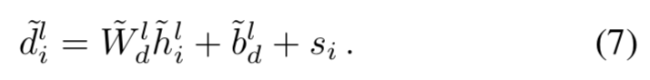
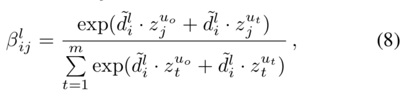
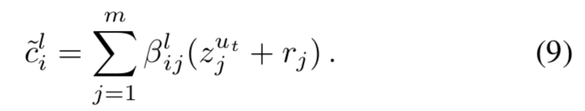
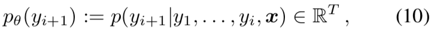
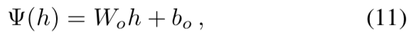
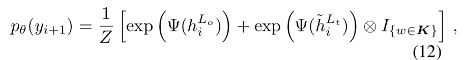
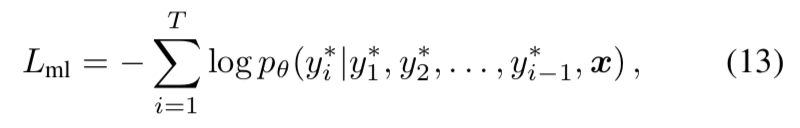
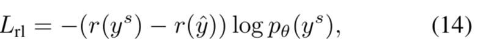
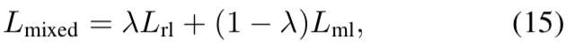

# 一种用于抽象式文本摘要的强化型可感知主题的卷积序列到序列模型
## A Reinforced Topic-Aware Convolutional Sequence-to-Sequence Model for Abstractive Text Summarization

由腾讯知文团队、苏黎世联邦理工学院、哥伦比亚大学和腾讯 AI Lab 的研究者联合提出的。
机器之心首先对其进行简要[介绍](https://www.jiqizhixin.com/articles/IJCAI2018-Tencent-Model-for-Abstractive-Text-Summarization
)。

本文提出了关于生成摘要的新的模型，即ConvS2S (the convolutional sequence-to-sequence model)，该模型是基于将注意力机制和带偏差的概率生成机制相结合，并引入
主题信息的卷积序列到序列的神经网络模型。并用强化学习方法[self-critical sequence training (SCST)](https://arxiv.org/abs/1612.00563)对模型进行优化。
该方法是将贪婪搜索（Greedy Search ）结果作为 REINFORCE 算法中的基线（Baseline），而不需要用另一个网络来估计基线的值。这样的基线设置会迫使采样结果能接近贪婪搜索结果。
这个方法能有效改善生成摘要的连贯性、差异性以及其携带的信息量。用强化学习方法来训练模型，以避免使用不可微的文本摘要指标ROUGE，而是直接优化模型，从而避免了在推断摘要期间的曝光偏差问题(exposure bias)。
- exposure bias：模型训练的时候用的是叫“Teacher-Forcing”的方式：输入RNN的上一时刻的单词是来自训练集的ground-truth单词。而在测试的时候依赖的是自己生成的单词，一旦生成得不好就会导致误差的积累，导致后面的单词也生成得不好。

自动摘要技术有两种类型，即抽取式（extraction）和生成式（abstraction）。抽取式摘要的目标是通过选择源文档中的重要片段并将它们组合来生成摘要；而生成式摘要则是根据文档的核心思想来重新组织生成摘要，因此这种摘要的灵活性更高。

本文的主要贡献有：
- 提出了结合多步注意力机制和带偏置生成机制的方法，将主题信息整合进了自动摘要模型中，引入上下文信息来帮助模型生成更连贯、多样性更强和信息更丰富的摘要。
- 使用了一种强化学习方法（SCST：self-critical sequence training），以针对文本摘要的指标 ROUGE 来直接优化模型，这也有助于缓解曝光偏差问题（exposure bias issue）。

### 相关工作
最先提出的ConvS2S模型是[《Convolutional Sequence to Sequence Learning》](https://arxiv.org/abs/1705.03122)这篇论文，网上有其[阅读笔记](https://zhuanlan.zhihu.com/p/26918935)。
但是这篇文章有几个缺陷：

- 其损失函数是通过最小化极大似然损失函数，这会使得生成摘要的质量和评估摘要的指标互相矛盾。
- exposure bias：训练模型用的是训练数据的分布，而在预测的时候，却将模型暴露在模型预测的数据分布中。
- 该论文提出的方法只使用词级的信息，而没有使用文章的其他信息，比如主题信息等。

### ConvS2S Architecture


ConvS2S架构包含了卷积神经网络模型(convolutional architecture)、输入词(input words)、主题(topics)、联合多步注意力机制(a joint multi-step attention mechanism)、偏差生成结构(a biased generation structure)、强化学习过程(a reinforcement learning procedure)

ConvS2S模型使用了两种卷积块，一个用于word-level embedding，一个用户topic-level embedding。

<b>embedding</b>

`x = (x1, . . . , xm)`表示输入的句子。输入元素的embed分布空间为 `w = (w1,...,wm)`，其中，wi ∈ R^d是随机初始化矩阵`Dword ∈ R^{V ×d}`中的一行；词汇表表示为V。
为了保留输入元素的位置信息，增加了位置embed，`p = (p1,...,pm)`，其中，pi ∈ R^d。最终，输入元素的embed为e = (w1 + p1 , . . . , wm + pm )。
用`q = (q1 , . . . , qn )`表示在decoder端输出元素的embedding。

<b>卷积层</b>

在encoder端和decoder端构建几层卷积神经网络，并且假设卷积核大小为k，输入元素的维度为d。那么卷积神经网络的将k个输入元素进行串联，得到X ∈ R^{kd}；映射得到的输出元素为Y ∈ R^{2d};
即：


其中：核矩阵为WY ∈ R^{2d×kd}。偏差bY∈ R^{2d}。

重写输出Y为Y=\[A; B],其中 A, B ∈ R^d。这里引入一个新的概念--gated linear unit(GLU)，这类似于激活函数。

g(\[A;B])=A ⊗ σ(B)

其中，⊗ 表示矩阵的元素相乘，σ是sigmoid函数。GLU的输出空间为R^d。GLU相当于Relu激活单元：(X * W + b)，加上一个Sigmoid激活单元：O(X * V + c)组成的。

我们用h^l =(h^l_1,...,h^l_n)表示decoder端第l层的输出， z^l = (z^l_1,...,z^l_m)表示encoder端的第l层输出。
下面以encoder端为例，第l个卷积层的第i个单元的计算公式为：


其中:h^l_i ∈ R^d，◦ 表示复合函数。

<b>多步注意力机制</b>

引入注意力机制是为了使模型获得更多文本的历史信息。
先embed当前的decoder状态h^l_i:


其中：q_i ∈ R^d 是先前decoded元素的embedding。权重 W_d^l ∈ R^{d×d}，偏差 b^l_d ∈ R^d。

在状态i和输入元素j的注意力权重α^l_{ij}的计算公式为：


其中：z^\{u_o}_j表示上一次encoder端的输出结果。

当前decoder层的条件输入c^l_i ∈ R^d的计算公式：


其中：ej表示输入元素的embedding，这样能够提供一些特别元素的位置信息。一旦c^l_i 被计算出来后，其将会作为decoder层h^l_i的输出，并应用到下一层h^{l+1}_i的输出。

<b>主题词嵌入</b>
将主题词引入到ConvS2S模型中，可以为文本摘要生成一些先验知识。在预训练之前，先用LDA模型(LDA模型采用Gibbs采样)生成每个文本的主题词，选择N个概率高的非常用词作为文本的主题词，生成了主题词汇表，其长度为K。
而且K ⊂ V。主题词嵌入矩阵为 `Dtopic ∈ R^{K×d}`。

当输入词汇在K中的时候，使用主题词嵌入矩阵`Dtopic`，如果不在主题词汇表中，就是用一般的词嵌入矩阵`Dword`。

主题词嵌入矩阵`Dtopic`由相关的预训练的主题词分布矩阵的标准化得到的，预训练的主题词分布矩阵的每一行的值是该词出现在每个主题中的次数。
而且位置嵌入向量也会加入到encoder端和decoder端的主题词向量中，主题词向量表示为：encoder端 `r = (r1,...,rm)`和decoder端 `s = (s1,...,sn)`。

<b>主题词嵌入与注意力机制相结合</b>

下面任意decoder端为例：

主题水平上的decoder的第l层第i卷积单元的计算公式与公式4类似：

`h̃ ^l_i ∈ R^d`

将主题信息通过联合注意力机制引入到模型中，联合注意力权重 `β^l_{ij}`的计算公式为：


其中，`z^{ut}_j`是最后一个encoder块`u_t`的输出。z^\{u0}_j表示一般的Conv块，z^\{ut}_j表示主题的Conv块。

条件输入`c̃ ^l_i ∈ R^d`的计算公式为：



在联合注意力机制中，`c̃ ^l_i 和 c^l_i`加到相关的decoder层 `h̃ ^l_i`的输出中，并作为下一层`h̃ ^{l+1}_i`输入的一部分。

<b>偏差概率的生成</b>

接下来，计算下一个目标元素的所有可能`y_{i+1} ∈ R^T`，即



通过一个线性层Ψ(·)转化前top的词等级的decoder端输出`h^\{L0}`和主题等级decoder端输出`h̃ ^{Lt}`。



其中,`W_o ∈ R^{T×d}`和 `b_o ∈ R^T`

偏差生成分布：



其中，Z是正则化项，`h^{Lo}_i`和`h^{Lt}_i`表示第i个top decoder端输出的词和主题。I是`y_{i+1}`中每个候选词w的one-hot指示向量。当候选词w是一个主题词时，我们将主题信息作为偏差项加入到模型中，否则，我们就忽略主题部分。
对某些文本，通过引入主题偏差项可以明显的减少搜索空间的复杂度，这是因为越重要的词越可能被直接使用。

<b>强化学习</b>

一般情况下，目标函数为在每一decode步极小最大似然估计损失函数：


但是这个目标函数对一些评估指标，如ROUGE，会产生一些次优结果。产生次优的原因在于
- 曝光偏差问题，即将模型暴露在训练数据的分布下，而不是数据本身的分布下。在训练模型的时候，我们使用的训练集的ground-truth词来预测下一个词，但是在测试的时候，使用的是预测的词来预测下一个词，这会导致误差会不断累计，从而使模型的结果恶化。
- 摘要的复杂性，最大似然目标奖励可以预测与引用完全相同的摘要的模型，同时惩罚产生不同文本的模型，即使它们在语义上相似。提供多种参考摘要是有帮助的，但并不是充分条件，因为提供可选摘要，可以重写摘要。
- 模型训练的时候用的是cross entropy loss，而evaluate的时候却用的是BLEU、ROUGE、METEOR、CIDEr等指标，存在不对应的问题。

为了解决这个问题，提出了self-critical sequence training (SCST)方法 —— 一种针对强化学习的策略梯度算法 —— 直接最大化不可微分的ROUGE指标。

使用强化学习，我们生成两个输出序列。第一个输出序列yˆ 由贪婪算法选择使输出概率最大的序列词；另一个输出序列y^s是对分布进行采样得到。

本文的目标函数：



其中，r(yˆ)和r(y^s)表示两个输出序列的ROUGE分数。

使用SCST方法，可以直接优化离散的评估指标。另外，r(yˆ)的“self-critical”为测试评估期提供了一个简单有效的基准线，并且提高了训练/测试的连贯性。
因为在学习期间，我们设置了强化学习的基准作为当前模型在测试期的奖励，SCST将模型暴露在其本身的分布中，并鼓励其产生一个高的ROUGE分数的输出序列yˆ，避免了爆炸偏差问题，改善了测试的表现

<b>数据处理和参数设置</b>

使用Gibbs采样的LDA模型初始化主题嵌入的语料库，主题嵌入矩阵值的初始化值为`均值为0`，`方差为0.1`。在本文中，选择每个主题前200个最高概率的词组成主题词集。在训练前，会过滤常用词。

在encoder端和decoder端都使用**6个卷积层**，所有的embeddings，包括初始化的embeddings以及decoder端结果的embeddings，它们维度有**256维**。我们将学习率设置为0.25，并且一旦验证ROUGE分数在每个时期之后停止增加直到学习率低于10-5，则将衰减率降低0.1。
我们首先用最大似然估计法来训练基本的可感知的主题卷积神经网络，然后训练最小混合目标函数，即强化学习对象`L_{rl}`和最大似然函数`L_{ml}`。



其中，影响因子λ设置为0.99。

判断模型的指标选择为ROUGE-L，作为强化学习的奖励函数。模型的更新方法为Nesterov’s accelerated gradient method 。
mini-batch 大小为32，学习率为0.0001。（两个学习率？）

针对中文的文本摘要，首先需要做的就是找到一个合适的数据预处理方法。一般处理中文有两种数据处理方法：一是基于字符级的，一是基于单词级的。前者是将每个字符作为输入，后者是需要将输入语句进行切分为词组。本文采用的是基于单词级，即将输入语句切分为单个词组。

但是最后实验结果表明，基于字符级的方法比基于单词级的方法，能够得到更高的ROUGE分数。


# 程序运行
对模型中强化学习部分的编程参考程序：https://github.com/weili-ict/SelfCriticalSequenceTraining-tensorflow.git  (个人感觉这个程序有很多错误的地方)

生成主题词语料库：
```
python LDACorpus.py
```

生成语料库
```

```

训练程序
```
python train.py
```

