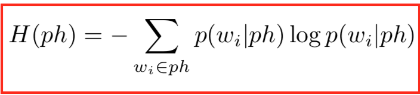
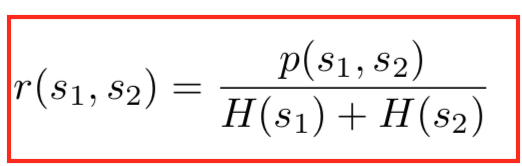
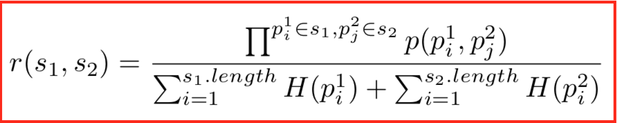
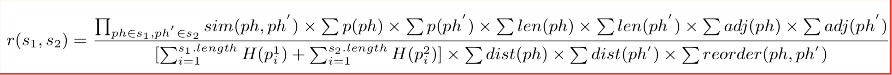

# 短文本分类
下面是阅读相关论文的读书笔记。

## A Method for Measuring Sentence Similarity and its Application to Conversational Agents
本文提出的方法，结合了文本语义相似性和词序相似性。用于计算语义相似性的信息来自于结构化词汇数据库和语料库统计信息。词序相似性是统计词语在句子中的位置。
而且该算法适用于对话领域。

### 算法理论
该算法基础是在计算句子的语义相似性和词序的基础上来计算语句的相似性。
语义的相似性的公式为：

假设有两个语句T_1,T_2。T_1和T_2的句子的词组成T。

s_1是一个向量,表示句子T_1的向量，向量的长度为T的长度。s_1中的元素s_i的值为：
- 如果词w在T_1中,哪个该位置的值为1。
- 如果词w不在T_1中，那么就计算词w和T_1中所有词的相似度。选择相似度最大的且该相似度的值大于设定的阈值(本文设定的阈值为0.2)时，那么该位置的值就是该相似度值。
  如果该相似度度值小于阈值，该位置度值设置为0。而且文章还提到由于词如果使用频率高的话，其携带的信息比哪些使用频率低的词携带的信息低。所以这些阈值还要乘上
  这两个词的概率的倒数。如果得到这两个词的使用概率呢？需要从语料库中统计词的使用概率。

上面提到要计算两次的相似性，本文提出利用同义词词库来计算两个词的相似度。中文的同义词使用的比较多的是哈工大社会计算与信息检索研究中心同义词词林扩展版。

公式中h表示层次结构中的子层深度。l表示两个词的最短路径长度。alpha的取值范围为[0,1]，默认值为0.2。beta的取值范围为[0,1]，默认值为0.45。

词序相似度的计算：
之所以要计算词序的相似度，文章中举了一个例子为:

T_1 :A quick brown dog jumps over the lazy fox。

T_2 :A quick brown fox jumps over the lazy dog。

这两个句子词是完全一样的，但是中间有两个词的顺序变了，其含义完全变了。
但是要将词序信息融入到理解自然语言中是非常困难的。

T = [A quick brown dog jumps over the lazy fox]

r_1也是一个词序向量，表示T_1的词序向量，其长度等于T的长度。

- 对于每个在T中的词，试图在T_1中或者找到相近的词。如果这个词没在T_1中，就计算该词与T_1中的词的相似度，且其相似度大于某个阈值(本文设置的阈值为0.4)，那么该位置
  的值就为该词的相似词在T_1中的index。如果没有大于阈值，那么该位置的值为0。

S_r表示了两个句子的共享词对的词序；S_r对单词对的两个单词之间的距离敏感，其值随着距离的增加而减少。

语义相似度代表了词汇的相似度，词序相似性代表了词的相关性。

sigma 的取值范围为\[0,1\]，本文设置的默认值为0.85。

## Structural Sentence Similarity Estimation for Short Texts

本文提出了一个新的方法：Structural Similarity。它摒弃了同义词或者语法等特征，比如路径或词性标签等。

结构相似性不考虑句子的实际意义上的相似性，而是更多地强调句子结构的相似性，以便发现目的或情感层面的相似性。
为了消除词意上的歧义，本文还提出了Word2Vec的变体来表示词汇。

提出该算法是基于人们总是喜欢用相似的语言结构表达相似的意思。

传统方法的缺点是：它们更多的关注语句的实际含义的相似性，这是因为它们在建模的时候仍然使用词网络和词性标签。
这使其很难扩展到社会网络语料库。

本文提出的Structural Similarity过多的强调语义分析。而且该算法能与其他算法结合起来解决其他问题，
该算法选取的特征能应用到其他短文本分析中。

结构句子相似性和语义相似性之间的区别有：\
1、结构句子相似性没有提取句子的语法规则，而是提取句子的结构\
2、词语的词义不适用于结构句子相似性，而上下文则适用于结构句子相似性

但是，结构相似性很难辨别句子的实际含义，特别是主体-对象的差异。比如："A cat chases a mouse"与"A mouse is chased by a cat"，
而不是"A mouse chases a cat"。然而，结构相似性更加倾向于后者，毕竟"cat"和"mouse"有更加频繁的类似的上下文。

结构相似性算法很容易与语义分析或者情感分析相结合，一起使用。

词向量的选择：
现在主流的词向量表示方法有：Word2Vec模型(CBOW 模型)和SkipThought模型。但是本文选择是的SkipGram模型。

- 如果是用一个词语作为输入，来预测它周围的上下文，那这个模型叫做『Skip-gram 模型』
- 而如果是拿一个词语的上下文作为输入，来预测这个词语本身，则是 『CBOW 模型』

The main drawback of the Word2Vec model is that since each word in SkipGram model has only one vector, it is hard to differentiate different meanings of a word. Moreover, pre- ceding and following contexts are not distinguished in the Word2Vec model, which are important in determining the borders of a phrase.

以前，我们主要依靠词的相似性来计算句子的相似性，这是基于每个词序列在段落中表达相同的含义这样的假定。
我们却忽略了短语对句子相似性计算的重要性。本文试图找到一个好的方法切分句子，通过对如下特征给予不同的分数；
这些特征有：word-level similarities(词水平的相似性), phrase formation possibilities(短语形成的可能性),
word adjacencies and sum distances(单词邻接和总距离), phrase length and existence reward with entropy and reorder penalties(短语长度和存在奖励与熵和重新排序处罚).

最长相似序列短语\
我们通过计算两个句子中相互匹配的词对的分数来组成两个句子的相关性矩阵。

特征设计：\
本文主要是从短语和句子两方面来提取特征。在短语方面，短语形成概率和短语相关性得分。在句子方面，考虑的是句子匹配情况和句子无序的得分。但是在评估短语时会给无序短语一定的容忍度，但完全忽略错误的短语，因为句子成分的顺序决定了句子的结构。

短语边界匹配\
根据经验，在一个方向上具有相似上下文的单词可能是两个相应短语的同一侧的边界。

Pboundary表示短语对两边的边界词的相似性。pre和post表示第一个字符的前后边界的词向量。
同理，pre'和post'表示第二字符的前后边界的词向量。

短语验证\
根据Skip-Gram模型的理论--给定上下文来预测中间字。使用该特性可以在给定上下词的边界，来预测中间词。
此外，我们通过奖励历史中现有的单词序列，为常用短语提供更多得分。

短语长度\
短语长度应该于短语相似性呈正相关。

短语中的词距\
在一个句子中，两个词相距越长，它们的相关性的可能性越小。在词距分析中，邻接词是分析的重点。
邻接词的组成短语的概率与单个词组成短语概率是非常巨大的。

词的重构成本\
有时候，错误的词序蕴含太多的信息，以至于无法忽略。所以我们不删除这些错误的词序，而是对每次词序的重排操作给予一定的惩罚。这使得重排词序操作越多，越不可能组成一个短语。

短语熵\
尽管动态切分语句系统能智能的切分语句，但是当如果我们只给予短语信息正的权重，那么其有可能会让一整段句子切分为一个短语。为了解决这个问题，引入了短语熵概念。

ph表示短语，wi表示短语中字。p(wi|ph)在这里表示字wi在短语ph中位置i的有效性。

语句熵\
同样在语句水平上，也有一样的问题。引入语句熵。p(wi |ph) 改变为sim(phi , ph′j )，sim(phi , ph′j )表示在句子1的每个短语ph与相应的句子2中短语的相似性。

句子相似性计算机制\

 p(s1 , s2 ) 表示两个相应短语乘积得分。 H(s1 )和H(s2)是句子1和句子2的句子熵。

p(p1i,p2j )表示句子1中短语p1i和句子2中短语p2j的相似得分。

p(p1)和p(p2)表示短语p1和p2是有效的概率。
变量begin和end表示每个短语第一个和最后一个期望的词。sim–计算的是前一半词的相似性。sim+计算的是后一半词的相似性。

短语水平上的特征\

p(w|p)计算的是字w拟合短语的程度，拟合程度的度量方法是字w向量和其上下文所有字的向量的和的相似性。\
len(p)刻画的是短语p的长度函数，而且是递增函数(根据经验是个平方函数)。\
exist(p)函数是检查存在的短语，并规范化到[0,1]作为奖励存在的短语。\
adj和dist函数度量的是在句子1中给定一组字以及句子2中给定一组对应的字，这些字对在原句子中是否是邻接字以及计算它们的期望距离和。

本文提到的方法采用的是自上而下的方法。对于输入的句子是作为一个整的短语。然后每一次迭代都是设置一个断点，这个断点或者设置到语句1，或者设置到语句2，或者两个语句都设置。设置的断点必须对两个语句的相似性有正的影响。如果没有断点存在，就停止循环。否则就更新得分矩阵，与此同时，进行句子切分。然后增加断点。

word2vec词向量的缺点：词可能含有不同的含义，但是该向量并没有表示出来。而且该词向量无法区分词的前后上下文的含义。

