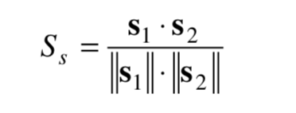
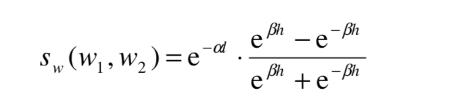
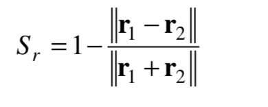

# 短文本分类
下面是阅读相关论文的读书笔记。

## A Method for Measuring Sentence Similarity and its Application to Conversational Agents
本文提出的方法，结合了文本语义相似性和词序相似性。用于计算语义相似性的信息来自于结构化词汇数据库和语料库统计信息。词序相似性是统计词语在句子中的位置。
而且该算法适用于对话领域。

### 算法理论
该算法基础是在计算句子的语义相似性和词序的基础上来计算语句的相似性。
语义的相似性的公式为：

假设有两个语句T_1,T_2。T_1和T_2的句子的词组成T。

s_1是一个向量,表示句子T_1的向量，向量的长度为T的长度。s_1中的元素s_i的值为：
- 如果词w在T_1中,哪个该位置的值为1。
- 如果词w不在T_1中，那么就计算词w和T_1中所有词的相似度。选择相似度最大的且该相似度的值大于设定的阈值(本文设定的阈值为0.2)时，那么该位置的值就是该相似度值。
  如果该相似度度值小于阈值，该位置度值设置为0。而且文章还提到由于词如果使用频率高的话，其携带的信息比哪些使用频率低的词携带的信息低。所以这些阈值还要乘上
  这两个词的概率的倒数。如果得到这两个词的使用概率呢？需要从语料库中统计词的使用概率。

上面提到要计算两次的相似性，本文提出利用同义词词库来计算两个词的相似度。中文的同义词使用的比较多的是哈工大社会计算与信息检索研究中心同义词词林扩展版。

公式中h表示层次结构中的子层深度。l表示两个词的最短路径长度。alpha的取值范围为[0,1]，默认值为0.2。beta的取值范围为[0,1]，默认值为0.45。

词序相似度的计算：
之所以要计算词序的相似度，文章中举了一个例子为:

T_1 :A quick brown dog jumps over the lazy fox。

T_2 :A quick brown fox jumps over the lazy dog。

这两个句子词是完全一样的，但是中间有两个词的顺序变了，其含义完全变了。
但是要将词序信息融入到理解自然语言中是非常困难的。

T = [A quick brown dog jumps over the lazy fox]

r_1也是一个词序向量，表示T_1的词序向量，其长度等于T的长度。

- 对于每个在T中的词，试图在T_1中或者找到相近的词。如果这个词没在T_1中，就计算该词与T_1中的词的相似度，且其相似度大于某个阈值(本文设置的阈值为0.4)，那么该位置
  的值就为该词的相似词在T_1中的index。如果没有大于阈值，那么该位置的值为0。

S_r表示了两个句子的共享词对的词序；S_r对单词对的两个单词之间的距离敏感，其值随着距离的增加而减少。

语义相似度代表了词汇的相似度，词序相似性代表了词的相关性。

sigma 的取值范围为[0,1]，本文设置的默认值为0.85。

## Structural Sentence Similarity Estimation for Short Texts

本文提出了一个新的方法：Structural Similarity。它摒弃了同义词或者语法等特征，比如路径或词性标签等。

结构相似性不考虑句子的实际意义，而是更多地强调句子结构的相似性，以便发现目的或情感层面的相似性。
为了消除词意上的歧义，本文还提出了Word2Vec的变体来表示词汇。

提出该算法是基于人们总是喜欢用相似的语法结构表达相似的意思。

